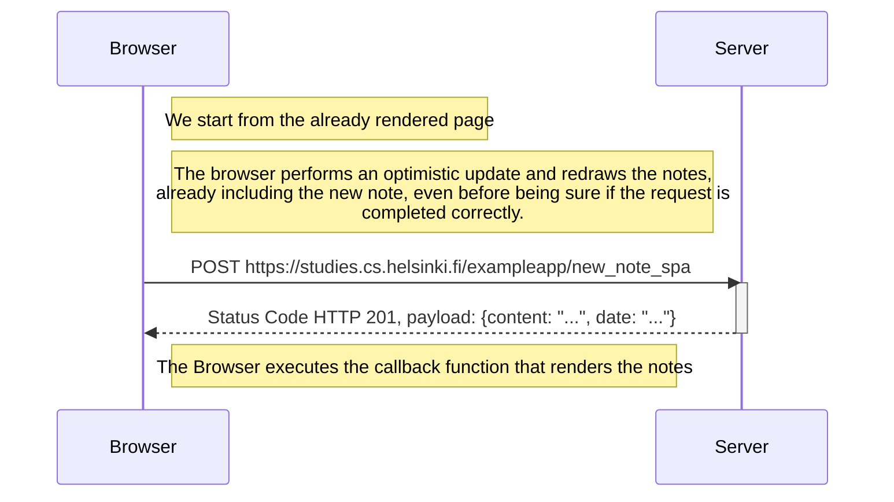

```mermaid
sequenceDiagram
    participant Browser
    participant Server

    Note right of Browser: We start from the already rendered page

    Note right of Browser: The browser performs an optimistic update and redraws the notes,<br/> already including the new note, even before being sure if the request is <br/>completed correctly.
    Browser->>Server: POST https://studies.cs.helsinki.fi/exampleapp/new_note_spa
    activate Server
    Server-->>Browser: Status Code HTTP 201, payload: {content: "...", date: "..."}
    deactivate Server

    Note right of Browser: The Browser executes the callback function that renders the notes
```
